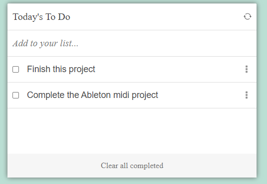

# Project - To-Do List

## Built With

- HTML
- CSS
- javaScript
- webpack

## Live Demo
[Live Demo Link](https://jasonfelice.github.io/To-Do-list/dist)

To get a local copy up and running follow these simple example steps.
- Copy this [link](https://github.com/jasonfelice/To-Do-list)
- Open the terminal
- Run "git clone" and paste the link
- Open this folder in your code editor
- Create a feature branch to work on
- Now you can edit and make a pull request

## Authors

👤 **Author1**

- GitHub: [@jasonfelice](https://github.com/jasonfelice)
- LinkedIn: [LinkedIn](https://www.linkedin.com/in/jason-felice-11a5a622b/)

## 🤝 Contributing

Contributions, issues, and feature requests are welcome!

Feel free to check the [issues page](../../issues/).

## Acknowledgments
- Reset icon by: [Icons8](https://icons8.com/icon/59872/refresh/)
- Menu Vertical icon by: [Icons8](https://icons8.com/icon/98963/menu-vertical/)
- Favicon icon by: [Icons8](https://icons8.com/icon/4528/to-do/)

## 📝 License

This project is [MIT](./MIT.md) licensed.